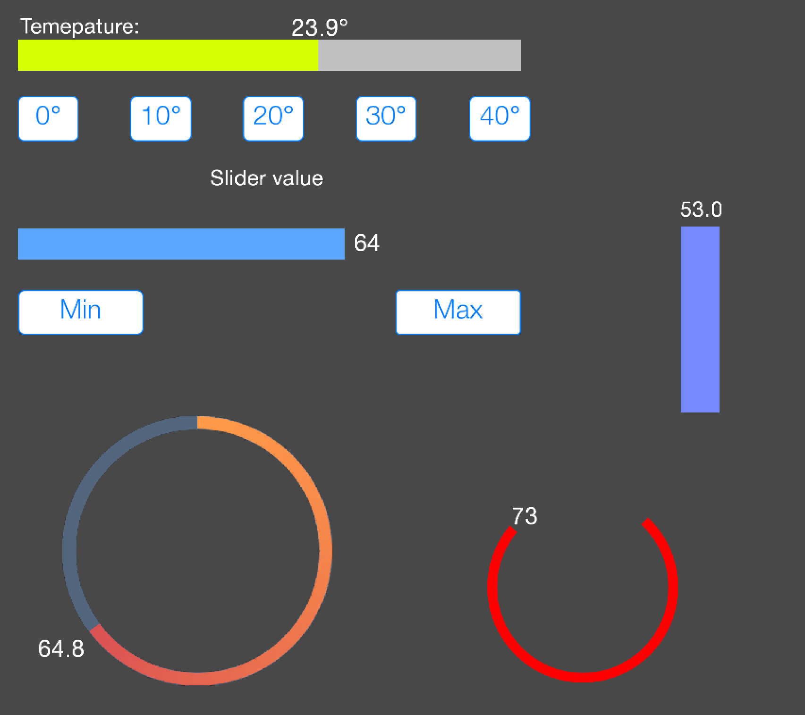

# Модуль SmartSlider для проектов в iRidium mobile

Модуль позволяет создавать горизонтальные вертикальные и круговые анимированные слайдеры в проектах [iRidium mobile](http://www.iridi.com).



**Возможности:**
- Анимация при изменении значений, анимация при появлении
- Движение метки со значением вместо со слайдером
- Изменение градиента цвета в зависимости от значения
- Возможность автоматического слежения за нужным тегом/фидбеком

## Тестовый собранный проект
Тестовый собранный проект находится в папке [build](https://github.com/bladerunner2020/smart-slider/tree/master/test/build). Тестовый проект собран при помощи утилиты [Iridium-Grunt](https://github.com/bladerunner2020/iridium-grunt), но модуль может использоваться, как вместе с **Iridium-Grunt**, так и без.

## Быстрый старт. Использование модуля без использования Iridium-Grunt.

**Шаг 1.** Скачать и добавить в проект скрипт [smart-slider.js](https://github.com/bladerunner2020/smart-slider/blob/master/smart-slider.js)
**Шаг 2.** Создать в вашем проекте вертикальный, горизонтальный или круговой слайдер (level). Делается это стандартными способами. 
**Шаг 3.** Добавить текстовый элемент для отображения текущего значения. В поле текст элемента указать **$V** - слайдер показывает целочисленные значения или **$Fx** (x - число знаков после запятой) - слайдер показывает значения с плавающей точкой. Положение слайдера соответствует максимальному значению. При изменении значения слайдера, текстовый элемент будет изменять значении и двигаться вслед за слайдером.
**Шаг 4.** Создать новый скрипт или добавить следующий код в существующий скрипт:

```javascript
// Main - имя страницы, на которой размещен слайдер
// Slider - имя элемента слайдера
var slider = new SmartSlider(IR.GetPage('Main').GetItem('Slider'));
slider
    .setValueItem(IR.GetPage('Main').GetItem('ValueLabel'))    // Имя текстового элемента, который отображает значение
    .setGradientColors(createColorGradient(0xFF00FF, 0x00FFFF, 100)) // Создаем и задаем градиент цвета
    .setAnimation(1000, IR.TWEEN_SINE_IN_OUT, 0)   // Задаем время (мс) и тип анимации, а также время задержки начала анимации (мс)
    .watchFeedback('Global.MyValue', 500) // За каким тегом/фидбеком следить и период опроса фидбека (мс)
    .update();
```

После этого слайдер готов к работе.

## Описание функций

- **setValueItem(item, freeze)** - установить элемент для отображения значений, если **freeze** = **true**, то элемент не будет двигаться
- **freezeValueItem(freeze)** - запретить/резрешить движение элемента при изменении значения слайдера. При "заморозке" элемента, он остается в текущем положении (не в начальном!)
- **setValueItemLimits(min, max)** - установить минимальное и максимальное значение, если значение слайдера находится вне этого диапазона, то привязанный текстовый элемент не двигается. Это можно использовать для того, чтобы текстовый элемент, например, не наезжал на подписи (см. слайдер темература в примере)
- **setGradientColors(gradient)** - устанавливает массив цветов для каждого значения слайдера. Размерность массива должна соответствовать размеру слайдера (максимальное - минимальное значения слайдера). Формат цвета: 0xRRGGBB. Для создания массива цветов можно использовать функции-помощники: **createColorGradient** и **createColorArray**.
- **setAnimation(time, type, delay)** - установить анимацию для слайдера. **time** - время анимации в мс, **type** - тип анимации, который используется для функции **IR.Tween** (по умолчанию используется **IR.TWEEN_LINEAR**), **delay** - задержка до начала анимации в мс (если на странице несколько слайдеров и нужно, чтобы их анимация была не одновременной)
- **watchFeedback(feedback, polltime)** - устанавливает связь с тегом или фидбеком **feedback**, опрос производится через промежуток **polltime** (мс). Важно, если используется данная функция в GUI не нужно создавать связь.
- **setAutoUpdate(pollTime)** - если не используется **watchFeedback**, а задается связь в GUI, то нужно задать автоматическое обновление, чтобы приводить все свойства в соответствие
- **update()** - обновить состояние слайдера без использования анимации
- **updateX(newValue, startValue, noDelay)** - обновить состояние слайдера с анимацией (если задана). **newValue** - установить новое значение, **startValue** - начальное значение, от которого будет происходить анимация, **noDelay** - игнорировать значение **delay** и запустить анимацию немедленно 
- **setValue(value, animate)** - установить значение **value** для слайдера, с анимацией, если **animate** - истина
- **getValue()** - возвращает текущее значение слайдера

## Больше примеров

```javascript
var gradient = createColorGradient(0x0000FF, 0x00FFFF, 11); // создаем синий градиент, 11 цветов
gradient = gradient.concat(createColorGradient(0x00FFFF, 0x00FF00, 7)); // создаем градиент от синего к зеленому, 7 цветом
gradient = gradient.concat(createColorGradient(0x00FF00, 0xFFFF00, 7)); // создаем градиент от зеленого к красному, 7 цветов
gradient = gradient.concat(createColorGradient(0xFFFF00, 0xFF0000, 15)); // создаем красный градиент 15 цветов

var tempSlider = new SmartSlider(IR.GetPage('Main').GetItem('Slider2')); // создаем слайдер для температуры
tempSlider
    .setValueItem(IR.GetPage('Main').GetItem('ValueLabel2'))   // добавляем текстовый элемент
    .setAnimation(1000, IR.TWEEN_CIRC_OUT, 1000)               // задаем время анимации, тип анимации, задержку
    .setValueItemLimits(260)                                   // устанавливаем минимальный лимит, чтобы элемент не наезжал на подпись
    .setGradientColors(gradient)            // Добавляем созданный градиент
    .update();                              // Начальное обновление
```

```javascript
// создаем массив цветов, состоящий из белого цвета для значений от 0 до 50, зеленого цвета для 50-70 и красного для 70-75
gradient = createColorArray([50, 70, 75], [0xFFFFFF, 0x00FF00, 0xFF0000]); 
var circularSlider2 = new SmartSlider(IR.GetPage('Main').GetItem('CircularLevel2'));  // создаем круговой слайдер
circularSlider2
    .setValueItem(IR.GetPage('Main').GetItem('CValueLabel2'))   // устанавливаем значение
    .setGradientColors(gradient)                                // задаем созданный градиент
    .setAnimation(1000, IR.TWEEN_SINE_IN_OUT, 3500)             // время анимации, тип и задержка
    .update();                                                  // начальное обновление
```

## Авторы

* Александр Пивоваров aka Bladerunner2020 ([pivovarov@gmail.com](mailto:pivovarov@gmail.com))

## Лицензия
Copyright (c) 2018 Александр Пивоваров

Данная лицензия разрешает лицам, получившим копию данного программного обеспечения и сопутствующей документации (в дальнейшем именуемыми «Программное Обеспечение»), безвозмездно использовать Программное Обеспечение без ограничений, включая неограниченное право на использование, копирование, изменение, слияние, публикацию, распространение, сублицензирование и/или продажу копий Программного Обеспечения, а также лицам, которым предоставляется данное Программное Обеспечение, при соблюдении следующих условий:

Указанное выше уведомление об авторском праве и данные условия должны быть включены во все копии или значимые части данного Программного Обеспечения.

ДАННОЕ ПРОГРАММНОЕ ОБЕСПЕЧЕНИЕ ПРЕДОСТАВЛЯЕТСЯ «КАК ЕСТЬ», БЕЗ КАКИХ-ЛИБО ГАРАНТИЙ, ЯВНО ВЫРАЖЕННЫХ ИЛИ ПОДРАЗУМЕВАЕМЫХ, ВКЛЮЧАЯ ГАРАНТИИ ТОВАРНОЙ ПРИГОДНОСТИ, СООТВЕТСТВИЯ ПО ЕГО КОНКРЕТНОМУ НАЗНАЧЕНИЮ И ОТСУТСТВИЯ НАРУШЕНИЙ, НО НЕ ОГРАНИЧИВАЯСЬ ИМИ. НИ В КАКОМ СЛУЧАЕ АВТОРЫ ИЛИ ПРАВООБЛАДАТЕЛИ НЕ НЕСУТ ОТВЕТСТВЕННОСТИ ПО КАКИМ-ЛИБО ИСКАМ, ЗА УЩЕРБ ИЛИ ПО ИНЫМ ТРЕБОВАНИЯМ, В ТОМ ЧИСЛЕ, ПРИ ДЕЙСТВИИ КОНТРАКТА, ДЕЛИКТЕ ИЛИ ИНОЙ СИТУАЦИИ, ВОЗНИКШИМ ИЗ-ЗА ИСПОЛЬЗОВАНИЯ ПРОГРАММНОГО ОБЕСПЕЧЕНИЯ ИЛИ ИНЫХ ДЕЙСТВИЙ С ПРОГРАММНЫМ ОБЕСПЕЧЕНИЕМ.
